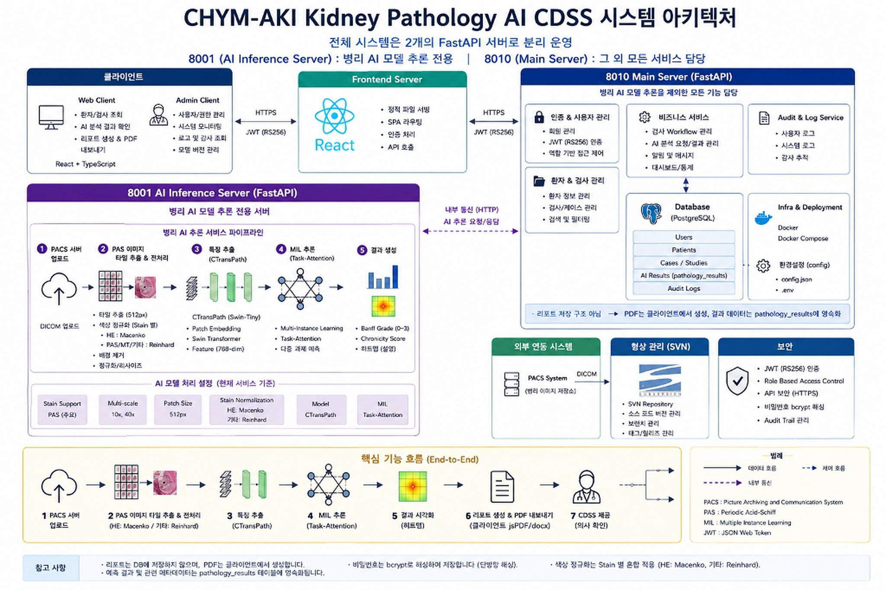
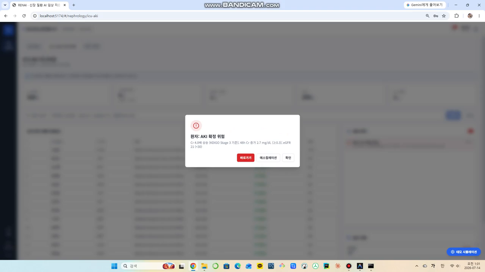
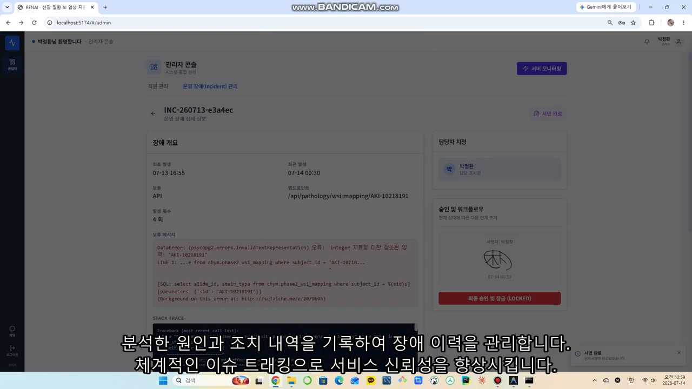
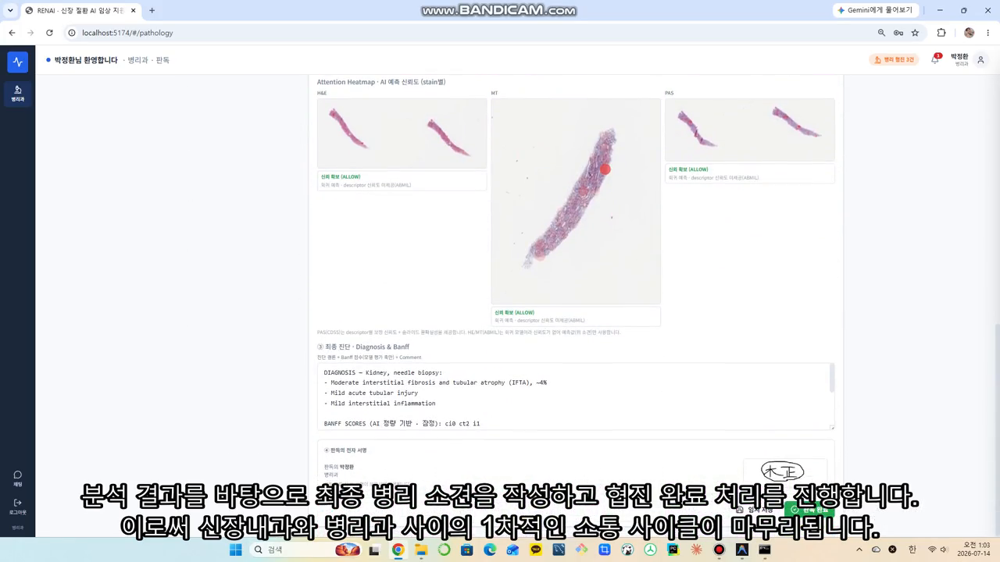
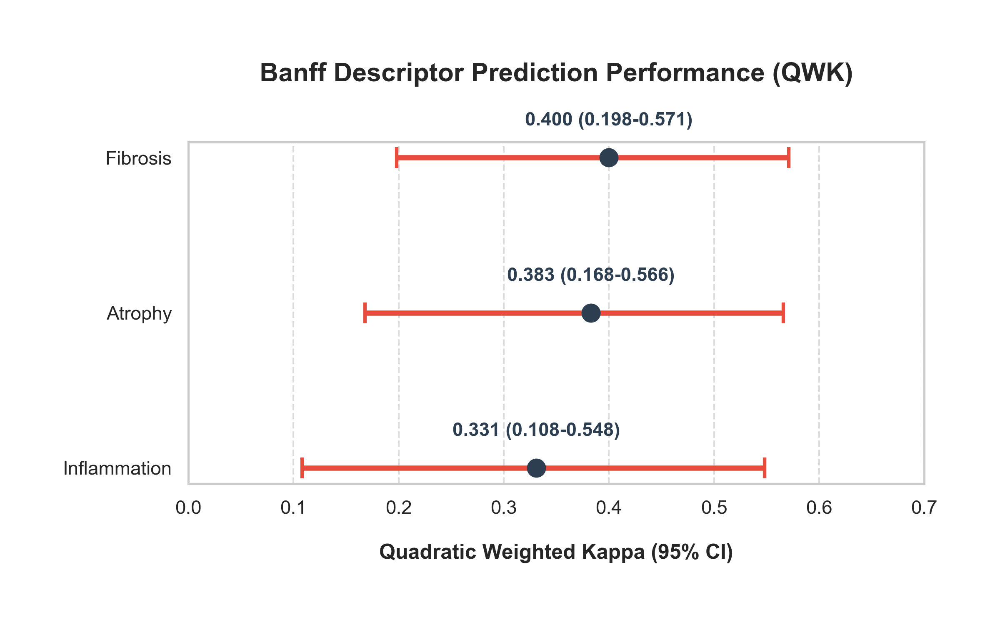
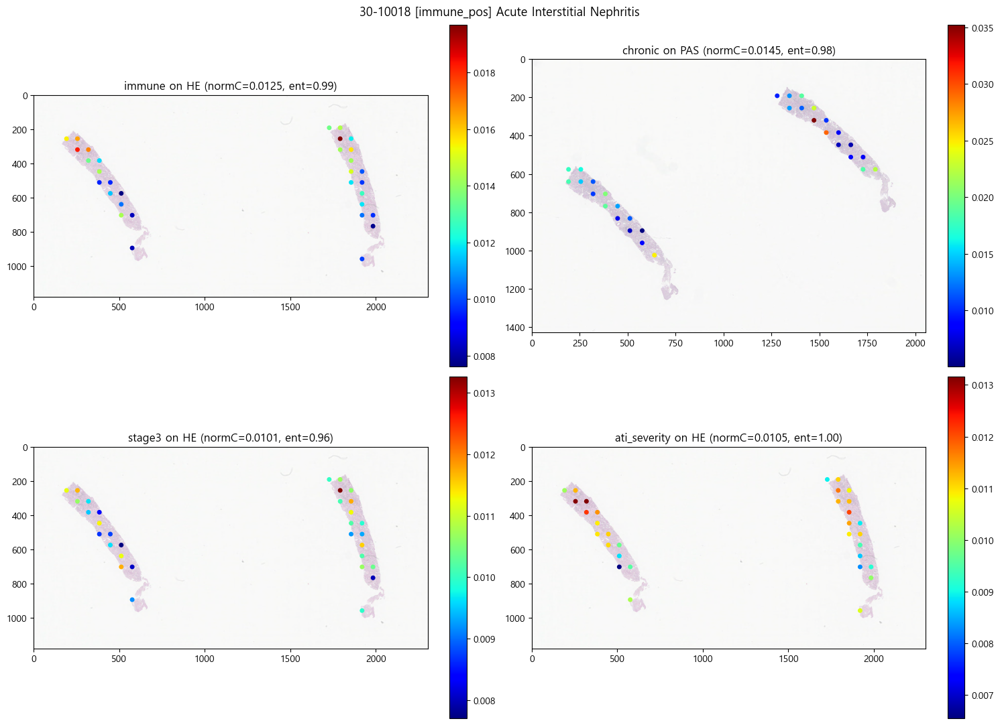

# 🔬 CHYM-AKI Pathology AI CDSS Platform

병리 이미지(WSI) AI 분석 결과를 기반으로 신장 질환(AKI) 진단 과정을 지원하고,
Banff 등급 추론 · 만성도(Chronicity) 점수화 · 히트맵 시각화를 제공하는
**웹 기반 병리 AI 임상 의사 결정 지원 시스템(CDSS)**입니다.

<video src="bandicam_demo.mp4" controls="controls" muted="muted" width="100%"></video>

> 실제 앱 데모 — 반디캠으로 녹화된 시연 영상을 통해 WSI 뷰어, AI 추론 결과 확인, 통합 마스터 리포트 출력 과정을 확인할 수 있습니다.

---

## 1. 프로젝트 소개

- **목적**: 기존 현미경 수작업 관찰에 의존하던 신장 병리 검사를 
  **AI 기반의 정량적 자동화 분석**으로 전환하여 진단 효율성과 정확성을 높입니다.
- **해결하려는 문제**: 거대한 WSI(Whole Slide Image) 환경에서 질환 부위를 특정하기 어렵습니다. 
  이를 해결하기 위해 타일 단위로 이미지를 쪼개고(MIL), 
  **설명 가능한 AI(히트맵)**를 통해 의사에게 시각적인 판단 근거를 제공합니다.
- **핵심 기능**: 병리 타일 추출 및 염색 정규화(Macenko) → CTransPath 특징 추출 → Task-Attention MIL 추론 
  → 2-Tier 서버(8010/8001) 기반 무중단 웹 서비스 제공.

---

## 2. 주요 기능

| 화면 | 기능 |
|------|------|
| 📊 WSI 뷰어 | 원본 병리 슬라이드 이미지 확대/축소 및 AI 추론 결과(히트맵) 오버레이 |
| 🧪 검사 관리 | 환자별 병리 검사 의뢰 목록 및 진행 상태 관리 |
| 🧑‍⚕️ 환자 관리 | 환자 메타데이터 및 진단 이력 조회 |
| 🔬 AI 리포트 | Banff 등급(0~3) 예측값 및 종합 소견이 담긴 리포트(PDF/docx) 내보내기 |
| ⚙️ 어드민 | 서버 상태 통합 모니터링, 시스템 로그(Telemetry), 권한 관리(RBAC) |

- WSI 다중 해상도(10x, 40x) 타일 추출
- 주요 염색 기법 대응 (HE, PAS, MT, Silver)
- 2-Tier 마이크로서비스 아키텍처 (메인 8010, AI 추론 8001 분리)
- 클라이언트 측 브라우저 PDF 렌더링 (jsPDF)

---

## 3. 시스템 아키텍처



> 데이터 수집(PACS) → 타일화 및 정규화 → 특성 추출(CTransPath) → 행동 분석(MIL Task-Attention) 
> → 시각화(Heatmap)의 흐름이 React 웹 클라이언트로 제공되며, 
> PostgreSQL에 사용자·환자·진단 결과 및 통합 감사 로그가 적재됩니다.
> (무거운 AI 연산은 8001 서버가, 일반 비즈니스 로직은 8010 서버가 독립적으로 담당합니다)

---

## 4. 기술 스택

| 분류 | 기술 |
|------|------|
| Language | Python 3.10+, TypeScript |
| Frontend / UI | React, Vite |
| Backend Server | FastAPI (8010 Main, 8001 AI Inference) |
| AI Model | PyTorch, CTransPath, Task-Attention MIL |
| Database | PostgreSQL, Docker Compose |
| Data Processing | Pandas, OpenCV, wsidicom |

---

## 5. 프로젝트 구조

```text
chym_aki/
├── backend/                 # FastAPI 기반 2-Tier 서버 소스코드
│   ├── main.py              # [8010] Main Server 진입점 (인증, 환자, DB 관리)
│   ├── wsi_main.py          # [8001] AI Inference Server 진입점 (GPU 추론 전용)
│   ├── api/, core/, db/     # 공통 로직, 데이터베이스 라우팅 및 설정
│   └── ml_models/, wsi/     # 머신러닝 파이프라인 및 PACS 연동 모듈
├── frontend/                # React 기반 웹 클라이언트 애플리케이션
│   ├── src/components/      # 재사용 가능한 UI 컴포넌트 모음
│   ├── src/features/        # 도메인별 핵심 화면 (pathology, retrieval, admin 등)
│   └── package.json         # 프론트엔드 패키지 의존성
├── Pathology_model/         # 병리 AI 연구 및 모델 학습 코드
│   ├── mil/                 # Task-Attention 다중 인스턴스 학습 아키텍처
│   └── scripts/             # CTransPath 백본 평가 및 결과 분석(QWK) 등
├── utils/                   # 🛠️ 부가 유틸리티 및 전처리 스크립트 모음
│   ├── check_*.py           # 데이터(CSV/좌표) 무결성 검증 용도
│   └── make_chart.py 등      # AI 학습 결과 시각화 차트 생성 스크립트
├── analysis_results/        # 📊 분석 파이프라인 데이터 및 최종 리포트 결과
│   ├── *.csv, *.jsonl       # 모델 평가 매니페스트 및 감사 로그(ab_events)
│   └── Integrated_Master_Report.html  # 최종 통합 분석 웹 리포트
├── scripts/                 # 프로젝트 환경 관리용 파워쉘/배치 스크립트
├── tests/                   # 시스템 V&V 및 유닛 테스트 코드
└── start_dev.bat            # 클릭 한 번으로 모든 서버(8010, 8001, 프론트) 동시 구동
```

---

## 6. 데이터셋

- **데이터 소스**: PACS 연동 기반 DICOM WSI (Whole Slide Image)
- **해상도**: Multi-scale (10x, 40x) / Patch Size (512px)
- **염색체(Stain) 분류**: 
  - HE (Hematoxylin & Eosin)
  - PAS (Periodic Acid-Schiff)
  - MT (Masson's Trichrome)
  - Silver (Jones Methenamine Silver)
- **전처리 (Stain Normalization)**: 
  - HE: **Macenko** 알고리즘 적용
  - 기타 염색체: **Reinhard** 알고리즘 적용

> ⚠️ 원본 병리 이미지(`aki_wsi/`)와 AI 모델 가중치 파일(`.safetensors`)은 용량 문제(수십 GB 이상)로
> `.gitignore` 처리되어 깃허브 저장소에 포함되지 않습니다.

---

## 7. 분석 파이프라인

`wsi_main.py` (8001 서버) 호출 시 5단계 계층으로 순차 처리됩니다.

```text
PACS DICOM
   ↓
[1] Tile Extraction   Multi-scale (10x, 40x) 512px 타일 분할 및 배경 제거
   ↓
[2] Normalization     HE(Macenko) / PAS, MT, Silver(Reinhard) 염색 정규화
   ↓
[3] Feature Layer     CTransPath 기반 768-dim 특징(Feature) 벡터 추출
   ↓
[4] MIL Inference     Task-Attention MIL 모델 → 다중 과제 예측 수행
   ↓
[5] Result Assembly   Banff Grade (0~3), Chronicity Score 산출 및 Heatmap 생성
   ↓
Main Server (8010) → React 웹 브라우저 렌더링
```

> AI 성능 저하 방지 및 임상 시스템과의 **실패 격리(Failure Isolation)**를 위해 
> 8001 서버는 DB 연결 없이 오직 HTTP 이미지 추론 파이프라인만 전담합니다.

---

## 8. 화면 (Screenshots)

**WSI 뷰어 및 히트맵** — 병리 슬라이드 탐색 및 AI 추론 결과 오버레이


**대시보드** — 통합 모니터링 및 전체 검사 처리 현황


**마스터 리포트 출력** — Banff 점수 및 병리 소견서 PDF 렌더링


---

## 9. 결과 (Results)

AI 모델 학습 및 K-Fold 교차 검증 산출물은 `analysis_results/`에 저장됩니다.

**성능 평가 (QWK - Quadratic Weighted Kappa)**


**모델 분석 히트맵 산출물**


그 외 산출물:
- **실험 평가 데이터**: `analysis_results/oof_cdss_v4_experiment_ctranspath.csv` 등
- **통합 웹 리포트**: `analysis_results/Integrated_Master_Report.html`

---

## 10. 실행 방법

### 통합 개발 환경 빠른 실행

```cmd
git clone https://github.com/leechaehui/chym_aki.git
cd chym_aki
start_dev.bat
```

> `start_dev.bat` 실행 시 3개의 독립된 서버가 한 번에 구동됩니다:
> 1) 프론트엔드 (Vite: 5174 포트)
> 2) 백엔드 메인 (uvicorn: 8010 포트)
> 3) AI 추론 전담 (uvicorn: 8001 포트)

### 모델 재학습 (백그라운드 / 밤샘 작업용)

```cmd
run_overnight_171.bat
```
> 가상환경 활성화, 모델 훈련 로직(`run_train_wandb.ps1`), 그리고 종료 시 PC 자동 시스템 종료(옵션)까지 관리합니다.

---

## 11. 향후 개선 사항

- [ ] PATIENT_SLIDE_LINKING_TODO 기반 환자-병리 이미지 완전 맵핑
- [ ] PACS 시스템 고도화 및 캐싱 메커니즘 최적화
- [ ] OOD(Out-of-Distribution) 데이터를 위한 Uncertainty 지표 UI 반영

---

## 참고: 시스템 통신 흐름도

- **Client (React)** ↔ HTTPS(JWT RS256) ↔ **Main Server (8010)** ↔ PostgreSQL
- **Main Server (8010)** ↔ HTTP 내부 통신 ↔ **AI Inference Server (8001)**
- 8010 서버만 개인키로 토큰 서명 권한을 가지며, 8001 서버는 공개키로 인가만 검증합니다. (보안 강화)
