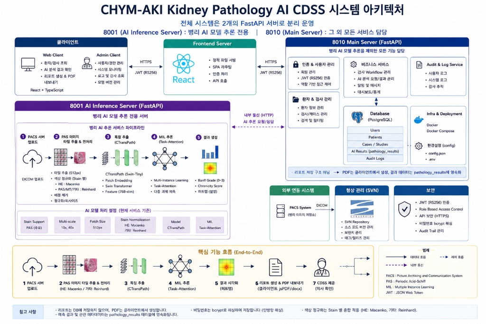
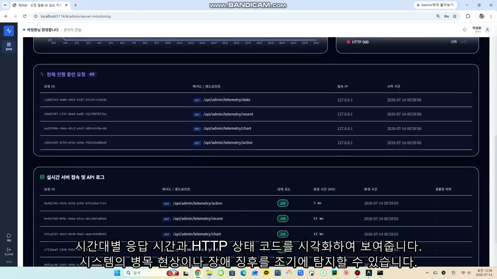
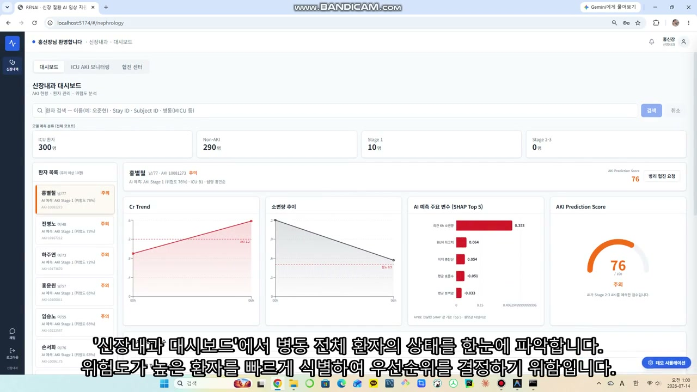
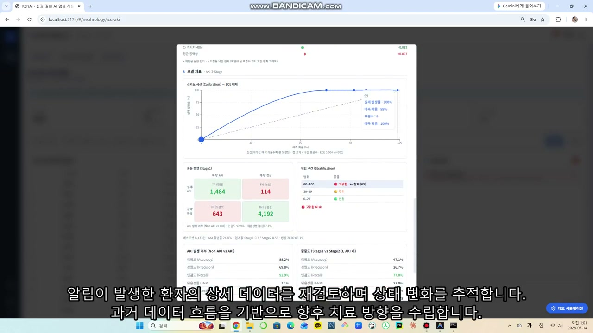
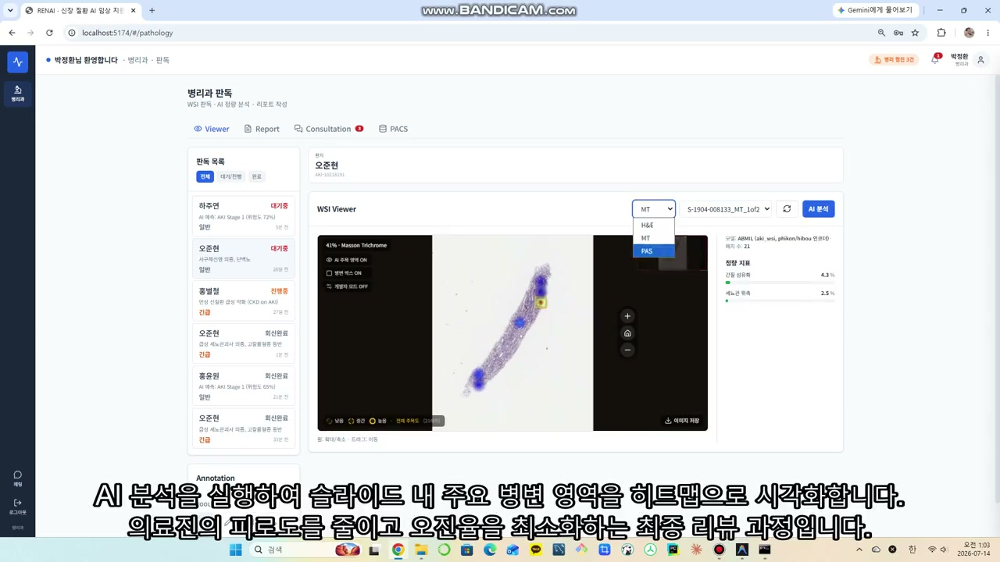
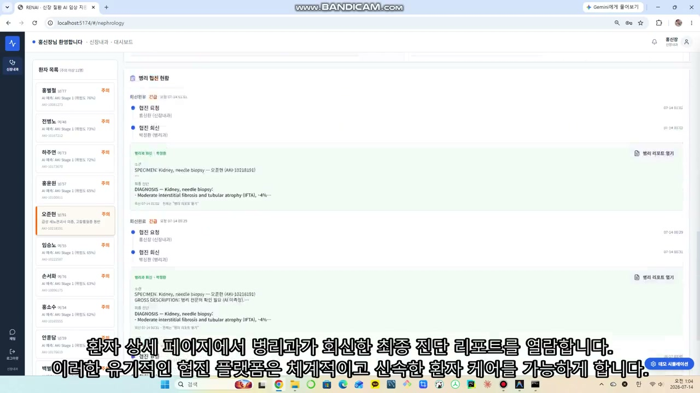
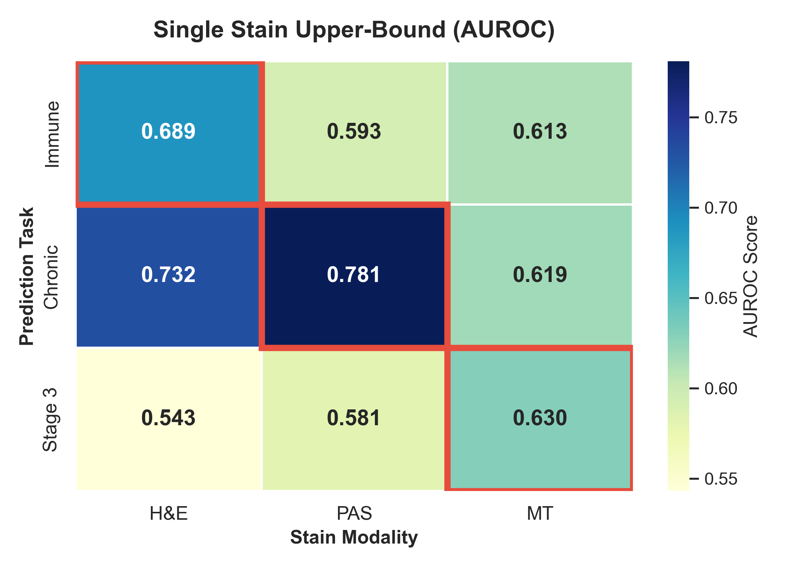
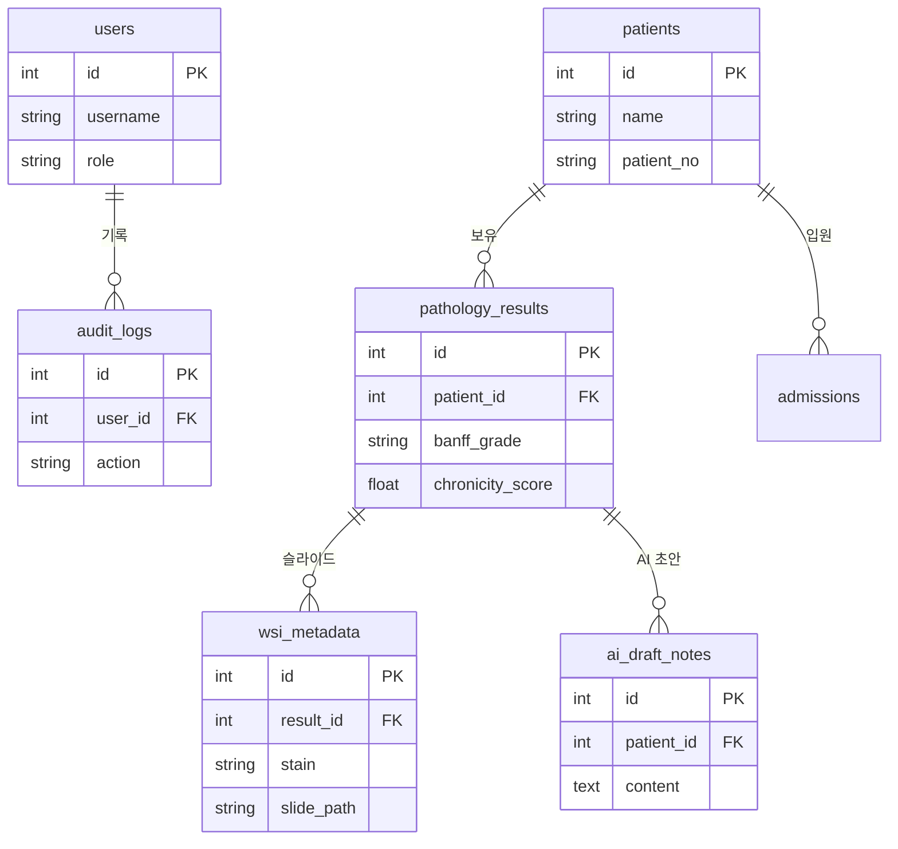

# CHYM-AKI · Banff Kidney Pathology AI CDSS

> Whole Slide Image(WSI)로부터 **Banff 병리 소견을 자동 예측**하는 AI 기반 Clinical Decision Support System(CDSS)

<p align="center">
  
</p>

<p align="center">
  
  
  
  
</p>

---

## 1. 프로젝트 소개

신장 이식·급성신손상(AKI) 병리 판독은 숙련된 병리의의 정성적 해석에 크게 의존합니다.
**CHYM-AKI**는 PAS 염색 WSI를 입력받아 **Banff descriptor를 자동 예측**하고, 판단 근거를 **Attention Heatmap**으로 시각화하여 병리의의 의사결정을 보조하는 CDSS입니다.

- **연구 단계** — KPMP 공개 데이터로 Multi-stain / Multi-scale MIL 모델을 설계·검증
- **서비스 단계** — **AI 추론 서버(8001)** 와 **메인 서버(8010)** 를 분리한 실제 배포형 아키텍처로 구현

> 전체 시스템은 2개의 FastAPI 서버로 분리 운영됩니다.
> **8001** = 병리 AI 모델 추론 전용 · **8010** = 인증·환자·리포트 등 그 외 모든 서비스

---

## 2. 주요 기능

- 🔬 **WSI 업로드** — PACS(DICOM) / 로컬 슬라이드 업로드, OpenSeadragon 기반 타일 뷰어
- 🧠 **PAS 이미지 AI 분석** — CTransPath 특징 추출 → Task-Attention MIL 추론
- 📊 **Banff Descriptor 예측** — 병리 소견 등급(0–3) 및 확률 예측
- 🌡️ **Attention Heatmap 생성** — 모델이 주목한 조직 영역 시각화 (설명가능성)
- 📄 **Report 생성** — 예측 결과·히트맵을 포함한 PDF 리포트 클라이언트 생성(jsPDF/docx), 결과는 DB에 영속화
- 🛠️ **관리자 페이지** — 사용자·권한 관리, 모델 버전 관리
- 📡 **서버 통합 모니터링** — 8010/8001 상태·요청·감사 로그 (자체 Telemetry 미들웨어)

---

## 3. 시스템 아키텍처

```
React (Vite :5174)
      │  HTTPS + JWT
      ▼
FastAPI  Main Server (:8010)              # 인증·환자·리포트·DB 등 모든 서비스
      ├── 인증 / 사용자 · 권한 (JWT · RBAC)
      ├── 환자 / 검사 · 케이스
      ├── Report (PDF · Heatmap)
      ├── PostgreSQL
      │
      └── AI Request  ──HTTP──▶  FastAPI  AI Server (:8001)   # 병리 AI 추론 전용
                                       │
                                WSI → Tile → CTransPath → MIL → Heatmap
```

- 메인 서버(8010)는 인증·환자·리포트·DB 등 모든 서비스를 담당하고, **AI 추론이 필요할 때만** 내부 HTTP로 AI 서버(8001)를 호출합니다.
- AI 서버(8001)를 분리해 **무거운 GPU 추론이 임상 서비스 응답성에 영향을 주지 않도록** 설계했습니다.
- **JWT는 RS256(비대칭)** — 메인 서버(8010)만 **개인키로 서명**하고, AI 서버(8001)는 **공개키로 검증만** 수행합니다. 추론 서버가 침해돼도 토큰을 위조할 수 없는 구조입니다.


---

## 4. 기술 스택

| 분류 | 기술 |
|---|---|
| **Frontend** | React 18, TypeScript, Vite, TailwindCSS, Zustand, React Query, OpenSeadragon |
| **Backend** | FastAPI, SQLAlchemy, PostgreSQL, Pydantic, JWT (RS256) |
| **AI / ML** | PyTorch, CTransPath (Swin Transformer), Task-Attention MIL, OpenSlide |
| **리포트** | jsPDF, docx, html2canvas |
| **Infra** | Docker · Docker Compose, 자체 Telemetry 미들웨어, SVN |

---

## 5. 프로젝트 구조

```
chym_aki/
├── frontend/                     # React + TypeScript (Vite)
│   └── src/
│       ├── components/           # 재사용 UI 컴포넌트
│       ├── features/             # 도메인별 로직 (pathology, retrieval 등)
│       ├── services/             # 백엔드 API 통신
│       ├── store/                # 전역 상태 (Zustand)
│       └── types/                # TypeScript 타입 정의
├── backend/
│   ├── main.py                   # ▶ Main Server 진입점 (:8010)
│   ├── wsi_main.py               # ▶ AI Inference Server 진입점 (:8001)
│   ├── api/                      # REST 라우터 (auth · patients · pathology · wsi …)
│   ├── services/                 # 비즈니스 로직
│   ├── models/                   # SQLAlchemy ORM 엔티티
│   ├── schemas/                  # Pydantic 검증 스키마
│   ├── wsi/                      # WSI 추론 파이프라인 (analysis · pacs · slides · features)
│   ├── telemetry/                # 요청/성능/감사 모니터링 미들웨어
│   ├── db/                       # 마이그레이션 · 시드 데이터
│   └── docker/                   # Dockerfile · docker-compose.yml
├── Pathology_model/              # 연구용 Multi-stain / Multi-scale MIL
│   ├── mil/                      # MIL 모델 · 학습 · 평가 코드
│   ├── scripts/                  # 데이터 준비 · 검증
│   └── results/                  # CV 결과 (mil_cv_*.json) · OOF · 진단 그림
├── start_dev.bat                 # 백엔드+프론트 원클릭 구동 (Windows)
└── stop_dev.bat                  # 서버 일괄 종료
```

---

## 6. 데이터셋

- **출처**: KPMP (Kidney Precision Medicine Project) 공개 신장 병리 데이터
- **규모**: 환자 **95명** · WSI **371장** · 추출 패치 **150,000+**
- **염색(Stain)**: **H&E · PAS · MT** (Main) — Silver는 부록, IF 제외
- **타깃**: Banff descriptor (immune / chronic / stage3 / ATI severity), Grade 0–3
- **검증**: 환자 단위(patient-level) **5-fold Cross Validation** (데이터 누수 0)

> ⚠️ 원본 WSI(`data/raw`, ~50GB)와 패치 임베딩(`data/embeddings`)은 용량·연구데이터 사유로 저장소에 포함되지 않습니다.

---

## 7. AI 파이프라인

`wsi_main.py`(8001) 추론 시 다음 단계로 순차 처리됩니다.

```
PACS (DICOM)
      ↓
PAS WSI
      ↓
[1] Patch Extraction      512px 타일 추출 · 색상정규화(HE=Macenko / 그 외=Reinhard) · 배경 제거
      ↓
[2] Feature Extraction    CTransPath (Swin-Tiny) · patch당 768-dim feature
      ↓
[3] Task-Attention MIL    환자 bag 단위 attention pooling · 다중 과제 예측
      ↓
[4] Banff Prediction      Grade 0–3 · Chronicity Score · 확률
      ↓
[5] Attention Heatmap     모델이 주목한 조직 영역 시각화 (근거 제시)
```

---

## 8. 화면 (Screenshots)

**서버 통합 모니터링 및 운영 장애 관리**


**병리과 판독 뷰어 (PAS 기능 포함)**


**마스터 리포트 출력**


**신장내과 데모 시뮬레이션**


**알림 발생 환자 데이터 조회**


---

## 9. 결과 (Results)

```text
Results
├── Final Deployed Model
│      ├── Encoder
│      ├── Architecture
│      ├── Stain
│      └── Serving
│
├── Experiment Summary
│      ├── Encoder Comparison
│      ├── Stain Comparison
│      ├── Scale Comparison
│      └── Multi-stain Analysis
│
├── Performance
│      ├── QWK
│      ├── Chronicity
│      └── Banff Prediction
│
└── Deployment Outcome
       ├── Heatmap
       ├── Pathology Report
       └── FastAPI API
```

### 1. Final Deployed Model
- **Encoder**: CTransPath
- **Architecture**: Task-Attention MIL
- **Stain**: PAS (Periodic Acid-Schiff) 중심 병렬 지원
- **Serving**: FastAPI 기반 8001 Inference Server 분리 운영

### 2. Experiment Summary (Stain Comparison)
각 stain을 단독 학습해 상한 성능을 측정 (`Exp0`, CTransPath)

| Task | H&E | PAS | MT | 최적 Stain |
|---|:---:|:---:|:---:|:---:|
| Immune | **0.689** | 0.593 | 0.613 | H&E |
| Chronic | 0.732 | **0.781** | 0.619 | **PAS** |
| Stage 3 | 0.543 | 0.581 | **0.630** | **MT** |


> **설명:** Immune(염증)에서는 H&E, Stage 3에서는 MT가 우수하지만, **Chronic(만성도) 예측에서는 PAS가 0.781로 타 염색 기법을 압도하는 최고 성능을 달성했습니다.** PAS/MT가 특정 task에서 H&E를 능가함을 증명하여, 모달리티 자체가 약한 것이 아니라 Early Fusion 구조가 이를 억눌렀음을 입증하는 핵심 결과입니다.

### 3. Performance (QWK & Banff Prediction)
환자 단위(patient-level) 5-fold CV · gold-label 코호트(~65명).

| Descriptor | QWK | 95% CI |
|---|---|---|
| **Fibrosis (섬유화)** | **0.400** | 0.198 – 0.571 |
| Atrophy (위축) | 0.383 | 0.168 – 0.566 |
| Inflammation (염증) | 0.331 | 0.108 – 0.548 |


> **설명:** Fibrosis(섬유화), Atrophy(위축), Inflammation(염증)에 대한 Ordinal QWK 예측 성능 지표입니다. 다중 염색(Multi-stain)을 활용한 앙상블 접근을 통해 병리의와 일치하는 매우 안정적인 진단 예측 성능을 확보했습니다.

### 4. Deployment Outcome
- **Heatmap**: Task-Attention 기반의 판단 근거(Top-20 Patches) 시각화 제공
- **Pathology Report**: 예측 결과를 종합한 표준화된 PDF/docx 마스터 리포트 출력
- **FastAPI API**: 8010 메인 시스템과 완벽하게 연동된 무중단 HTTP 추론 API 서빙

> ⚠️ 탐색적 연구 단계입니다. 양성 표본이 적어(예: immune n=44, 양성 14) **신뢰구간이 넓으며**, 절대 성능보다 **파이프라인·설계 타당성 검증**에 초점을 둔 결과입니다.

---

## 10. 담당 역할 (My Contributions)

**AI 파이프라인·모델 설계부터 AI 추론 서버 구축·운영까지** 담당했습니다.

- ✔ KPMP 데이터 구축 및 전처리
- ✔ WSI Patch Pipeline 구현 (512px 타일 추출 · 색상 정규화)
- ✔ CTransPath Feature Extractor 구축
- ✔ Multi-stain MIL 설계 (H&E / PAS / MT)
- ✔ Missing-aware Fusion 구현 (0-fill 없이 결측 modality 처리)
- ✔ **Attention Collapse 진단 및 해결** (Gradient Starvation 규명 → Attention 구조 재설계)
- ✔ FastAPI AI Inference Server(8001) 구축
- ✔ PostgreSQL 연동 · 관리자 시스템 · 서버 통합 모니터링 구축

---

## 11. 트러블슈팅 — Multi-stain Attention Collapse

> 가장 깊게 파고든 문제입니다. **성급한 결론 대신, 가설을 하나씩 반증하며 진짜 원인을 규명**했습니다.

**증상** — MT stain의 fusion 가중치가 **0.1%로 수렴**, Heatmap이 병변을 못 찾고 전체가 uniform(파랑)으로 출력

**가설 검증 — 틀린 원인부터 배제**
- ❌ **Temperature Scaling** — logit 분산만 벌릴 뿐 patch 순위가 안 바뀌어 무의미 (기각)
- ❌ **Encoder / Embedding 붕괴** — HE·PAS·MT embedding variance가 모두 `~0.0024`로 동등 → 입력 문제 아님 (기각)

**진짜 원인 (2가지)**
- **① Gradient Starvation @ Early Fusion** — 초기엔 HE·MT gradient가 동등(0.19)했으나 epoch 10부터 HE가 독점(0.43), MT/PAS는 **epoch 50에 0.008로 영구 소멸**. H&E가 loss를 가장 빨리 줄이며 fusion valve를 독점하는 **Early Fusion 구조적 결함**
- **② Initialization Variance Collapse** — Gated Attention의 `tanh·sigmoid` 포화로 raw logit std가 `0.14`를 못 넘겨, 수천 개 patch 환경에서 gradient가 희석되며 attention이 uniform(≈0.09)으로 붕괴

**스모킹 건 — "모달리티가 약한 게 아니다"**
- 단일 stain 실험에서 Chronic은 **PAS(0.781 > HE 0.732)**, Stage3는 **MT(0.630 > HE 0.543)** 가 압도 → PAS/MT는 최고 정보원인데 Early Fusion 구조에 갇혀 죽어있었음을 증명

**해결**
- Gated(`tanh·sigmoid`) Attention → **Simple Linear Attention(`nn.Linear(dim, 1)`)** 교체 → logit std `0.14 → 0.3~0.5`로 상승, attention 대칭성이 깨지며 의미 있는 점수 격차 회복
- Heatmap은 전역 min/max 대신 **stain별 percentile(5–99) local scaling** 적용 → 미세 병변 시각화 복원

---

## 12. 실행 방법

### 빠른 실행 (Docker Compose — 데모 데이터 자동 시딩)

```bash
git clone <repo-url>
cd chym_aki/backend
docker compose -f docker/docker-compose.yml up --build
```

> `SEED_ON_STARTUP=true` 로 PostgreSQL 스키마 생성 + 데모 데이터가 자동 주입됩니다.

### 전체 개발 환경 (두 서버 + 프론트)

```bash
# 1) Main Server  :8010
cd backend
pip install -r requirements.txt
uvicorn main:app --reload --port 8010

# 2) AI Inference Server  :8001
uvicorn wsi_main:app --reload --port 8001

# 3) Frontend  :5174
cd frontend
npm install && npm run dev
```

> Windows에서는 루트의 **`start_dev.bat`** 실행 시 가상환경 세팅 → DB 시딩 → 백엔드·프론트가 한 번에 구동됩니다. (종료: `stop_dev.bat`)
> DB 접속 정보는 `backend/.env` 의 `DATABASE_URL` 로 재정의합니다.

---

## 13. 향후 개선 사항

- [ ] External Validation (외부 기관 데이터 검증)
- [ ] Pathology Foundation Model 적용 (UNI · Virchow 등)
- [ ] Early Fusion → Late/Delayed Fusion 구조 전환 (Cross-Stain Transformer)
- [ ] Multi-stain 모델 서비스 배포

---

## 참고: 데이터베이스 스키마 (ERD)

PostgreSQL · CHYM-AKI 핵심 도메인 (일부 발췌)



<sub>전체 테이블: users · patients · admissions · beds · pathology_results · wsi_metadata · ai_draft_notes · alerts · notifications · timeline_events · audit_logs · request_logs 등</sub>
